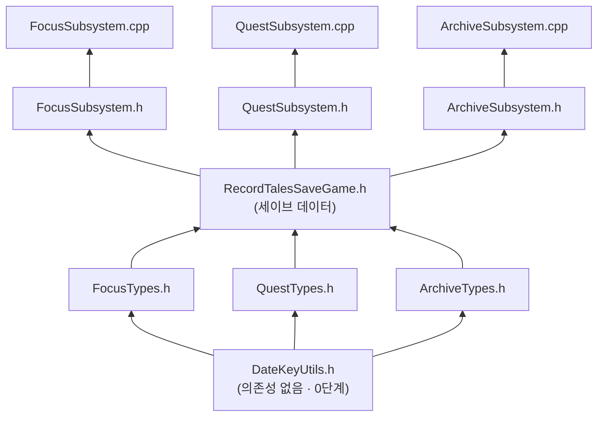

# RecordTales UE — C++ 파일 구조 설계

> 실제 UE C++ 프로젝트에서 작업할 때 파일별 담당 범위와 의존성을 정의합니다.
> 코딩 시작 전 이 문서를 먼저 확인하고, 어느 파일에 무엇을 작성할지 결정하세요.

---

## 목차

0. [구조 한눈에 보기](#0-구조-한눈에-보기)
1. [디렉터리 구조](#1-디렉터리-구조)
2. [파일별 담당 범위](#2-파일별-담당-범위)
3. [파일 간 의존성](#3-파일-간-의존성)
4. [파일별 스켈레톤](#4-파일별-스켈레톤)
5. [작업 순서 가이드](#5-작업-순서-가이드)

---

## 0. 구조 한눈에 보기

> 처음 보면 헷갈릴 수 있어서, 전체 구조를 그림으로 먼저 보여드립니다.
> **아래쪽 = 의존성 없음(가장 먼저 작성) → 위쪽 = 아래 계층에 의존(나중에 작성)** 방향입니다.



**읽는 법**
- 화살표는 "화살표를 받는 파일이 화살표를 보낸 파일에 의존한다(= `#include` 한다)"는 뜻입니다.
- `DateKeyUtils.h`는 맨 아래(0단계)에 있고 누구에게도 의존하지 않으므로, 새 코드를 작성할 때 항상 **가장 먼저** 손대는 파일입니다.
- 새 시스템을 추가할 때도 이 그림과 같은 위치에 파일을 끼워 넣으면 됩니다 (자세한 순서는 [5. 작업 순서 가이드](#5-작업-순서-가이드) 참고).

> 각 파일에 들어가는 **구조체별 역할과 필드별 의미/예시값**은 [data-structure-guide.md](./data-structure-guide.md)에 따로 정리되어 있습니다.

---

## 1. 디렉터리 구조

UE의 Public / Private 관례를 따른다.  
- **Public**: 다른 파일에서 `#include` 가능한 헤더  
- **Private**: 해당 .cpp 파일에서만 사용하는 구현

```
Source/RecordTales/
│
├── Public/
│   ├── Utils/
│   │   └── DateKeyUtils.h        ← UDateKeyLibrary (날짜 키 유틸, 의존성 없음)
│   │
│   ├── Types/
│   │   ├── FocusTypes.h          ← 집중 시스템 열거형·구조체
│   │   ├── ArchiveTypes.h        ← 아카이브·카테고리 열거형·구조체
│   │   └── QuestTypes.h          ← 퀘스트 열거형·구조체
│   │
│   ├── Subsystems/
│   │   ├── FocusSubsystem.h      ← UFocusSubsystem 클래스 선언
│   │   ├── ArchiveSubsystem.h    ← UArchiveSubsystem 클래스 선언
│   │   └── QuestSubsystem.h      ← UQuestSubsystem 클래스 선언
│   │
│   └── Save/
│       └── RecordTalesSaveGame.h ← URecordTalesSaveGame 클래스 선언
│
└── Private/
    ├── Utils/
    │   └── DateKeyUtils.cpp      ← UDateKeyLibrary 구현
    │
    ├── Subsystems/
    │   ├── FocusSubsystem.cpp    ← UFocusSubsystem 구현
    │   ├── ArchiveSubsystem.cpp  ← UArchiveSubsystem 구현
    │   └── QuestSubsystem.cpp    ← UQuestSubsystem 구현
    │
    └── Save/
        └── RecordTalesSaveGame.cpp
```

---

## 2. 파일별 담당 범위

### Public/Utils/DateKeyUtils.h

`date-key-utils.md` 설계를 그대로 구현. 다른 어떤 타입에도 의존하지 않는, 의존성 트리 최하단의 정적 함수 라이브러리.

| 종류 | 이름 | 설명 |
|---|---|---|
| Class | `UDateKeyLibrary` (UBlueprintFunctionLibrary) | "YYYYMMDD" DateKey 문자열 연산 14개 정적 함수 |

주요 함수: `GetTodayDateKey`, `IsValidDateKey`, `AddDays`/`NextDateKey`/`PrevDateKey`, `AddYears`, `DaysBetween`, `DayOfWeek`/`DayOfMonth`, `StartOfWeek`/`EndOfWeek`, `StartOfMonth`/`EndOfMonth`, `FormatDisplayDate`. 전체 시그니처와 구현은 `date-key-utils.md` 참조.

---

### Public/Types/FocusTypes.h

집중 시스템(타이머·스톱워치)에서만 쓰는 타입.

| 종류 | 이름 | 설명 |
|---|---|---|
| Enum | `EFocusMode` | Timer / Stopwatch |
| Enum | `ETimerPhase` | Idle / Focusing / Resting / LastResting / Paused |
| Enum | `ESessionEndReason` | NormalComplete / EarlyStop |
| Struct | `FTimerConfig` | 타이머 설정값 (영속) |
| Struct | `FTimerRuntimeState` | 타이머 진행 상태 (비영속) |
| Struct | `FStopwatchState` | 스톱워치 진행 상태 (비영속) |

---

### Public/Types/ArchiveTypes.h

아카이브·카테고리·기록 관련 타입.

| 종류 | 이름 | 설명 |
|---|---|---|
| Enum | `EArchPeriodFilter` | Daily / Weekly / Monthly |
| Enum | `EArchModeFilter` | All / TimerOnly / SwOnly |
| Enum | `EDeleteCategoryMode` | MigrateToOther / KeepOrphan / DeleteRecords |
| Struct | `FCategoryDef` | 카테고리 이름 + 색상 (영속) |
| Struct | `FSessionRecord` | 집중 세션 기록 1건 (영속) |
| Struct | `FArchiveDateRange` | 날짜 범위 Start / End (비영속) |
| Struct | `FDayActivityDots` | 캘린더 날짜별 도트 데이터 (비영속) |
| Struct | `FArchiveFilterState` | 현재 필터 상태 (비영속) |
| Struct | `FArchiveQueryResult` | 쿼리 결과 전체 (비영속) |

---

### Public/Types/QuestTypes.h

퀘스트 시스템 타입. `quest-data.md` 설계 반영.

| 종류 | 이름 | 설명 |
|---|---|---|
| Enum | `EQuestRecurrence` | None / Daily / Weekly / Monthly — 반복 주기 |
| Enum | `EQuestState` | Active / Done / Overdue / Suspended / Upcoming |
| Struct | `FQuestMaster` | 퀘스트 원본/템플릿 (영속, 불변 위주) |
| Struct | `FQuestInstance` | 퀘스트 인스턴스 — 회차별 진행 상태 (영속, 개정판) |
| Struct | `FDdayInfo` | D-day 표시 정보 (비영속) |

---

### Public/Subsystems/FocusSubsystem.h

```
UFocusSubsystem (UGameInstanceSubsystem)
├── 멤버 변수
│   ├── EFocusMode         CurrentMode
│   ├── FTimerConfig       TimerConfig        (영속 — SaveGame 연동)
│   ├── FTimerRuntimeState RuntimeState       (비영속)
│   └── FStopwatchState    SwState            (비영속)
└── 주요 함수 선언
    ├── StartTimer()
    ├── StopTimer(ESessionEndReason)
    ├── TogglePause()
    ├── StartStopwatch()
    ├── StopStopwatch()
    ├── ToggleSwPause()
    └── CreateSessionRecord() → FSessionRecord
```

---

### Public/Subsystems/ArchiveSubsystem.h

```
UArchiveSubsystem (UGameInstanceSubsystem)
├── 멤버 변수
│   ├── TArray<FSessionRecord>  AllRecords      (영속 — SaveGame 연동)
│   ├── TArray<FCategoryDef>    Categories      (영속 — SaveGame 연동)
│   └── FArchiveFilterState     CurrentFilter   (비영속)
└── 주요 함수 선언
    ├── AddRecord(FSessionRecord)
    ├── GenerateRecordId() → FString
    ├── QueryArchive(FArchiveFilterState) → FArchiveQueryResult
    ├── ComputeDateRange(FString, EArchPeriodFilter) → FArchiveDateRange
    ├── ComputeActivityDotMap(int32 Year, int32 Month) → TMap<FString, FDayActivityDots>
    ├── AddCategory(FString Name, FString Color) → bool
    ├── RenameCategory(FString OldName, FString NewName) → bool
    ├── UpdateCategoryColor(FString Name, FString Color) → bool
    ├── DeleteCategory(FString Name, EDeleteCategoryMode, FString Target)
    ├── GetCategoryColor(FString Name) → FString
    └── GetRecordCountByCategory(FString Name) → int32
```

---

### Public/Subsystems/QuestSubsystem.h

`quest-data.md` 11.의 함수 시그니처를 그대로 반영.

```
UQuestSubsystem (UGameInstanceSubsystem)
├── 멤버 변수
│   ├── TArray<FQuestMaster>    QuestMasters     (영속 — SaveGame 연동)
│   └── TArray<FQuestInstance>  QuestInstances   (영속 — SaveGame 연동)
└── 주요 함수 선언
    ├── 생성/조회
    │   ├── GenerateMasterId() → FString
    │   ├── CreateQuest(FQuestMaster) → FString
    │   ├── FindMaster(FString MasterId) → FQuestMaster*
    │   └── FindInstance(FString InstanceId) → FQuestInstance*
    │
    ├── 발생/롤오버
    │   ├── QuestOccursOn(FQuestMaster, FString Dk) → bool
    │   ├── GenerateInstanceIfNeeded(FQuestMaster, FString Dk)
    │   ├── GenerateUpcomingInstance(FQuestMaster)
    │   ├── ProcessDailyRollover()
    │   └── RefreshAllInstanceStates()
    │
    ├── 상태/표시
    │   ├── ComputeInstanceState(FQuestInstance) → EQuestState
    │   ├── ComputeDday(FString DueDateKey) → FDdayInfo
    │   └── CountOverdue() → int32
    │
    └── 사용자 액션
        ├── ToggleDone(FString InstanceId)
        ├── ToggleSuspend(FString InstanceId, FString Reason)
        ├── DeleteQuest(FString MasterId)
        ├── ApplyRecurrenceRemoval(FString MasterId, FString NewRecEndDateKey, TArray<EQuestState> StatusesToDelete)
        └── DuplicateAsTodayQuest(FString SourceMasterId) → FString
```

---

### Public/Save/RecordTalesSaveGame.h

```
URecordTalesSaveGame (USaveGame)
├── Focus
│   ├── FTimerConfig   LastTimerConfig
│   └── EFocusMode     LastFocusMode
├── Archive
│   ├── TArray<FSessionRecord>  SessionRecords
│   ├── TArray<FCategoryDef>    Categories
│   ├── FString                 LastRecordDate
│   └── int32                   DailyRecordSequence
└── Quest
    ├── TArray<FQuestMaster>    QuestMasters
    ├── TArray<FQuestInstance>  QuestInstances
    ├── FString                 LastQuestDate          (MasterId 시퀀스용)
    ├── int32                   DailyQuestSequence
    └── FString                 LastQuestRolloverDate  (자정 롤오버 마지막 처리일)
```

---

### Private/Utils/DateKeyUtils.cpp

`DateKeyUtils.h`에 선언된 `UDateKeyLibrary` 정적 함수들의 구현.
`date-key-utils.md` 4. 구현 내용을 그대로 옮긴다. 다른 어떤 모듈도 의존하지 않으므로 가장 먼저 작성·컴파일 가능.

### Private/Subsystems/FocusSubsystem.cpp

`FocusSubsystem.h`에 선언된 함수들의 구현.  
타이머 틱, 페이즈 전환, 기록 생성 후 `UArchiveSubsystem::AddRecord()` 호출.

### Private/Subsystems/ArchiveSubsystem.cpp

`ArchiveSubsystem.h`에 선언된 함수들의 구현.  
`GenerateRecordId()`, `QueryArchive()`, 카테고리 CRUD 로직 포함. 날짜 계산은 `UDateKeyLibrary` 사용.

### Private/Subsystems/QuestSubsystem.cpp

`QuestSubsystem.h`에 선언된 함수들의 구현.  
`quest-data.md` 5~10.의 ID 생성, 발생 판정, 자정 롤오버, 상태 판정, D-day, 반복 제거 로직 포함. 날짜 계산은 `UDateKeyLibrary` 사용.

### Private/Save/RecordTalesSaveGame.cpp

생성자에서 기본 카테고리 + 퀘스트 카운터 초기화.

```cpp
URecordTalesSaveGame::URecordTalesSaveGame()
{
    // 기본 카테고리 세팅
    Categories = {
        { TEXT("공부"),     TEXT("") },
        { TEXT("프로젝트"), TEXT("") },
        { TEXT("업무"),     TEXT("") },
        { TEXT("독서"),     TEXT("") },
        { TEXT("운동"),     TEXT("") },
        { TEXT("기타"),     TEXT("") },
    };
    LastRecordDate      = TEXT("");
    DailyRecordSequence = 0;

    // 퀘스트 ID·롤오버 카운터 초기화
    LastQuestDate          = TEXT("");
    DailyQuestSequence     = 0;
    LastQuestRolloverDate  = TEXT("");
}
```

---

## 3. 파일 간 의존성

의존성이 단방향으로만 흐르도록 설계한다. 순환 참조 금지.

```
DateKeyUtils.h
  └── (의존 없음 — 엔진 기본 타입 FString/FDateTime/FTimespan만 사용)

RecordTalesSaveGame.h
  └── #include "Types/FocusTypes.h"
  └── #include "Types/ArchiveTypes.h"
  └── #include "Types/QuestTypes.h"

FocusSubsystem.h
  └── #include "Types/FocusTypes.h"
  └── #include "Types/ArchiveTypes.h"   ← FSessionRecord 생성에 필요

ArchiveSubsystem.h
  └── #include "Types/ArchiveTypes.h"
  └── #include "Types/QuestTypes.h"     ← 퀘스트 버킷 분류에 필요
  └── #include "Save/RecordTalesSaveGame.h"

QuestSubsystem.h
  └── #include "Types/QuestTypes.h"
  └── #include "Save/RecordTalesSaveGame.h"

FocusSubsystem.cpp
  └── #include "Subsystems/FocusSubsystem.h"
  └── #include "Subsystems/ArchiveSubsystem.h"  ← AddRecord() 호출

ArchiveSubsystem.cpp
  └── #include "Subsystems/ArchiveSubsystem.h"
  └── #include "Subsystems/QuestSubsystem.h"    ← QueryArchive() 내 퀘스트 조회
  └── #include "Utils/DateKeyUtils.h"           ← GenerateRecordId(), ComputeDateRange()

QuestSubsystem.cpp
  └── #include "Subsystems/QuestSubsystem.h"
  └── #include "Utils/DateKeyUtils.h"           ← 발생 판정, 롤오버, D-day 계산
```

> **Types 파일끼리는 서로 include 하지 않는다.**  
> DateKeyUtils.h → (의존 없음, 최하단)  
> Types → DateKeyUtils.h (필요 시; 현재는 직접 사용 없음)  
> SaveGame.h → Types  
> Subsystem.h → Types + SaveGame.h  
> Subsystem.cpp → Subsystem.h + DateKeyUtils.h + 다른 Subsystem.h

---

## 4. 파일별 스켈레톤

실제 코딩 시 복사해서 시작하는 뼈대 코드.

### DateKeyUtils.h

```cpp
#pragma once
#include "CoreMinimal.h"
#include "Kismet/BlueprintFunctionLibrary.h"
#include "DateKeyUtils.generated.h"

UCLASS()
class RECORDTALES_API UDateKeyLibrary : public UBlueprintFunctionLibrary
{
    GENERATED_BODY()

public:
    UFUNCTION(BlueprintCallable, Category="DateKey") static FString GetTodayDateKey();
    UFUNCTION(BlueprintCallable, Category="DateKey") static bool    IsValidDateKey(const FString& Dk);

    UFUNCTION(BlueprintCallable, Category="DateKey") static FString AddDays(const FString& Dk, int32 Days);
    UFUNCTION(BlueprintCallable, Category="DateKey") static FString NextDateKey(const FString& Dk);
    UFUNCTION(BlueprintCallable, Category="DateKey") static FString PrevDateKey(const FString& Dk);
    UFUNCTION(BlueprintCallable, Category="DateKey") static FString AddYears(const FString& Dk, int32 Years);
    UFUNCTION(BlueprintCallable, Category="DateKey") static int32   DaysBetween(const FString& From, const FString& To);

    UFUNCTION(BlueprintCallable, Category="DateKey") static int32   DayOfWeek(const FString& Dk);
    UFUNCTION(BlueprintCallable, Category="DateKey") static int32   DayOfMonth(const FString& Dk);

    UFUNCTION(BlueprintCallable, Category="DateKey") static FString StartOfWeek(const FString& Dk);
    UFUNCTION(BlueprintCallable, Category="DateKey") static FString EndOfWeek(const FString& Dk);
    UFUNCTION(BlueprintCallable, Category="DateKey") static FString StartOfMonth(const FString& Dk);
    UFUNCTION(BlueprintCallable, Category="DateKey") static FString EndOfMonth(const FString& Dk);

    UFUNCTION(BlueprintCallable, Category="DateKey") static FString FormatDisplayDate(const FString& Dk);

private:
    static FDateTime DateKeyToDateTime(const FString& Dk);
    static FString   DateTimeToDateKey(const FDateTime& Dt);
};
```

### FocusTypes.h

```cpp
#pragma once
#include "CoreMinimal.h"
#include "FocusTypes.generated.h"

UENUM(BlueprintType)
enum class EFocusMode : uint8 { ... };

UENUM(BlueprintType)
enum class ETimerPhase : uint8 { ... };

UENUM(BlueprintType)
enum class ESessionEndReason : uint8 { ... };

USTRUCT(BlueprintType)
struct FTimerConfig { GENERATED_BODY() ... };

USTRUCT(BlueprintType)
struct FTimerRuntimeState { GENERATED_BODY() ... };

USTRUCT(BlueprintType)
struct FStopwatchState { GENERATED_BODY() ... };
```

### ArchiveTypes.h

```cpp
#pragma once
#include "CoreMinimal.h"
#include "ArchiveTypes.generated.h"

UENUM(BlueprintType)
enum class EArchPeriodFilter : uint8 { ... };

UENUM(BlueprintType)
enum class EArchModeFilter : uint8 { ... };

UENUM(BlueprintType)
enum class EDeleteCategoryMode : uint8 { ... };

USTRUCT(BlueprintType)
struct FCategoryDef { GENERATED_BODY() ... };

USTRUCT(BlueprintType)
struct FSessionRecord { GENERATED_BODY() ... };

USTRUCT(BlueprintType)
struct FArchiveDateRange { GENERATED_BODY() ... };

USTRUCT(BlueprintType)
struct FDayActivityDots { GENERATED_BODY() ... };

USTRUCT(BlueprintType)
struct FArchiveFilterState { GENERATED_BODY() ... };

USTRUCT(BlueprintType)
struct FArchiveQueryResult { GENERATED_BODY() ... };
```

### QuestTypes.h

```cpp
#pragma once
#include "CoreMinimal.h"
#include "QuestTypes.generated.h"

UENUM(BlueprintType)
enum class EQuestRecurrence : uint8 { ... }; // None/Daily/Weekly/Monthly

UENUM(BlueprintType)
enum class EQuestState : uint8 { ... }; // Active/Done/Overdue/Suspended/Upcoming

USTRUCT(BlueprintType)
struct FQuestMaster { GENERATED_BODY() ... };

USTRUCT(BlueprintType)
struct FQuestInstance { GENERATED_BODY() ... };

USTRUCT(BlueprintType)
struct FDdayInfo { GENERATED_BODY() ... }; // 비영속
```

> 각 구조체의 전체 필드 정의는 `quest-data.md` 4. 참조.

### FocusSubsystem.h

```cpp
#pragma once
#include "CoreMinimal.h"
#include "Subsystems/GameInstanceSubsystem.h"
#include "Types/FocusTypes.h"
#include "Types/ArchiveTypes.h"
#include "FocusSubsystem.generated.h"

UCLASS()
class RECORDTALES_API UFocusSubsystem : public UGameInstanceSubsystem
{
    GENERATED_BODY()

public:
    virtual void Initialize(FSubsystemCollectionBase& Collection) override;
    virtual void Deinitialize() override;

    UFUNCTION(BlueprintCallable) void StartTimer();
    UFUNCTION(BlueprintCallable) void StopTimer(ESessionEndReason Reason);
    UFUNCTION(BlueprintCallable) void TogglePause();
    UFUNCTION(BlueprintCallable) void StartStopwatch();
    UFUNCTION(BlueprintCallable) void StopStopwatch();
    UFUNCTION(BlueprintCallable) void ToggleSwPause();

    UPROPERTY(BlueprintReadOnly) EFocusMode         CurrentMode;
    UPROPERTY(BlueprintReadOnly) FTimerConfig        TimerConfig;
    UPROPERTY(BlueprintReadOnly) FTimerRuntimeState  RuntimeState;
    UPROPERTY(BlueprintReadOnly) FStopwatchState     SwState;

private:
    FSessionRecord CreateSessionRecord(ESessionEndReason Reason);
    FTimerHandle   TickHandle;
    void OnTick();
};
```

### ArchiveSubsystem.h

```cpp
#pragma once
#include "CoreMinimal.h"
#include "Subsystems/GameInstanceSubsystem.h"
#include "Types/ArchiveTypes.h"
#include "Types/QuestTypes.h"
#include "ArchiveSubsystem.generated.h"

UCLASS()
class RECORDTALES_API UArchiveSubsystem : public UGameInstanceSubsystem
{
    GENERATED_BODY()

public:
    virtual void Initialize(FSubsystemCollectionBase& Collection) override;

    // 기록
    UFUNCTION(BlueprintCallable) void    AddRecord(const FSessionRecord& Record);
    UFUNCTION(BlueprintCallable) FString GenerateRecordId();

    // 쿼리
    UFUNCTION(BlueprintCallable)
    FArchiveQueryResult QueryArchive(const FArchiveFilterState& Filter);

    UFUNCTION(BlueprintCallable)
    FArchiveDateRange ComputeDateRange(const FString& AnchorDateKey,
                                       EArchPeriodFilter Period);

    UFUNCTION(BlueprintCallable)
    TMap<FString, FDayActivityDots> ComputeActivityDotMap(int32 Year, int32 Month);

    // 카테고리
    UFUNCTION(BlueprintCallable) bool    AddCategory(const FString& Name, const FString& Color);
    UFUNCTION(BlueprintCallable) bool    RenameCategory(const FString& OldName, const FString& NewName);
    UFUNCTION(BlueprintCallable) bool    UpdateCategoryColor(const FString& Name, const FString& Color);
    UFUNCTION(BlueprintCallable) void    DeleteCategory(const FString& Name,
                                                         EDeleteCategoryMode Mode,
                                                         const FString& Target = TEXT(""));
    UFUNCTION(BlueprintCallable) FString GetCategoryColor(const FString& Name) const;
    UFUNCTION(BlueprintCallable) int32   GetRecordCountByCategory(const FString& Name) const;

    UPROPERTY(BlueprintReadOnly) TArray<FSessionRecord> AllRecords;
    UPROPERTY(BlueprintReadOnly) TArray<FCategoryDef>   Categories;
    UPROPERTY(BlueprintReadOnly) FArchiveFilterState     CurrentFilter;

private:
    class URecordTalesSaveGame* SaveGame = nullptr;
    void LoadFromSave();
    void SaveToDisk();
};
```

### QuestSubsystem.h

```cpp
#pragma once
#include "CoreMinimal.h"
#include "Subsystems/GameInstanceSubsystem.h"
#include "Types/QuestTypes.h"
#include "QuestSubsystem.generated.h"

UCLASS()
class RECORDTALES_API UQuestSubsystem : public UGameInstanceSubsystem
{
    GENERATED_BODY()

public:
    virtual void Initialize(FSubsystemCollectionBase& Collection) override;

    // 생성/조회
    UFUNCTION(BlueprintCallable) FString GenerateMasterId();
    UFUNCTION(BlueprintCallable) FString CreateQuest(const FQuestMaster& InMaster);
    FQuestMaster*   FindMaster(const FString& MasterId);
    FQuestInstance* FindInstance(const FString& InstanceId);

    // 발생/롤오버
    bool QuestOccursOn(const FQuestMaster& Master, const FString& Dk) const;
    void GenerateInstanceIfNeeded(const FQuestMaster& Master, const FString& Dk);
    void GenerateUpcomingInstance(const FQuestMaster& Master);
    UFUNCTION(BlueprintCallable) void ProcessDailyRollover();
    void RefreshAllInstanceStates();

    // 상태/표시
    EQuestState ComputeInstanceState(const FQuestInstance& Inst) const;
    UFUNCTION(BlueprintCallable) FDdayInfo ComputeDday(const FString& DueDateKey) const;
    UFUNCTION(BlueprintCallable) int32     CountOverdue() const;

    // 사용자 액션
    UFUNCTION(BlueprintCallable) void   ToggleDone(const FString& InstanceId);
    UFUNCTION(BlueprintCallable) void   ToggleSuspend(const FString& InstanceId, const FString& Reason);
    UFUNCTION(BlueprintCallable) void   DeleteQuest(const FString& MasterId);
    UFUNCTION(BlueprintCallable) void   ApplyRecurrenceRemoval(const FString& MasterId,
                                                                const FString& NewRecEndDateKey,
                                                                const TArray<EQuestState>& StatusesToDelete);
    UFUNCTION(BlueprintCallable) FString DuplicateAsTodayQuest(const FString& SourceMasterId);

    UPROPERTY(BlueprintReadOnly) TArray<FQuestMaster>   QuestMasters;
    UPROPERTY(BlueprintReadOnly) TArray<FQuestInstance> QuestInstances;

private:
    class URecordTalesSaveGame* SaveGame = nullptr;
    void LoadFromSave();
    void SaveToDisk();
};
```

### RecordTalesSaveGame.h

```cpp
#pragma once
#include "CoreMinimal.h"
#include "GameFramework/SaveGame.h"
#include "Types/FocusTypes.h"
#include "Types/ArchiveTypes.h"
#include "Types/QuestTypes.h"
#include "RecordTalesSaveGame.generated.h"

UCLASS()
class RECORDTALES_API URecordTalesSaveGame : public USaveGame
{
    GENERATED_BODY()

public:
    URecordTalesSaveGame();

    // Focus
    UPROPERTY() FTimerConfig LastTimerConfig;
    UPROPERTY() EFocusMode   LastFocusMode = EFocusMode::Timer;

    // Archive
    UPROPERTY() TArray<FSessionRecord> SessionRecords;
    UPROPERTY() TArray<FCategoryDef>   Categories;
    UPROPERTY() FString                LastRecordDate;
    UPROPERTY() int32                  DailyRecordSequence = 0;

    // Quest
    UPROPERTY() TArray<FQuestMaster>   QuestMasters;
    UPROPERTY() TArray<FQuestInstance> QuestInstances;
    UPROPERTY() FString                LastQuestDate;
    UPROPERTY() int32                  DailyQuestSequence = 0;
    UPROPERTY() FString                LastQuestRolloverDate;
};
```

---

## 5. 작업 순서 가이드

파일 간 의존성 때문에 아래 순서대로 작성해야 컴파일 오류가 나지 않는다.

```
0단계 — 날짜 유틸 (의존성 없음, 최우선)
  DateKeyUtils.h
  DateKeyUtils.cpp

1단계 — Types (의존성 없음, 먼저 완성)
  FocusTypes.h
  QuestTypes.h
  ArchiveTypes.h

2단계 — SaveGame (Types 완성 후)
  RecordTalesSaveGame.h
  RecordTalesSaveGame.cpp

3단계 — Subsystem 헤더 (SaveGame 완성 후)
  QuestSubsystem.h
  FocusSubsystem.h
  ArchiveSubsystem.h

4단계 — Subsystem 구현 (헤더 + DateKeyUtils 완성 후)
  QuestSubsystem.cpp    ← DateKeyUtils 필요
  FocusSubsystem.cpp    ← ArchiveSubsystem 필요하므로 3번 이후
  ArchiveSubsystem.cpp  ← QuestSubsystem, DateKeyUtils 필요하므로 1, 3번 이후
```

---

## 업데이트 이력

| 날짜 | 내용 |
|---|---|
| 2026-06-09 | 초안 작성. Public/Private 구조, 파일별 담당 범위, 의존성, 스켈레톤, 작업 순서 정의 |
| 2026-06-11 | `quest-data.md`/`date-key-utils.md` 반영. `Utils/DateKeyUtils.h` 추가(0단계), `QuestTypes.h`에 `EQuestRecurrence`/`FQuestMaster`/`FDdayInfo` 추가 및 `FQuestInstance` 개정, `QuestSubsystem.h` 전체 함수 시그니처 확정, `RecordTalesSaveGame.h` Quest 필드(QuestMasters, LastQuestDate, DailyQuestSequence, LastQuestRolloverDate) 추가, 의존성·작업순서 갱신 |
