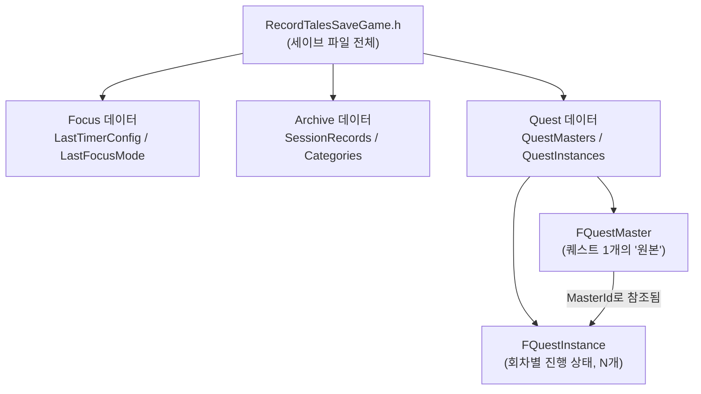
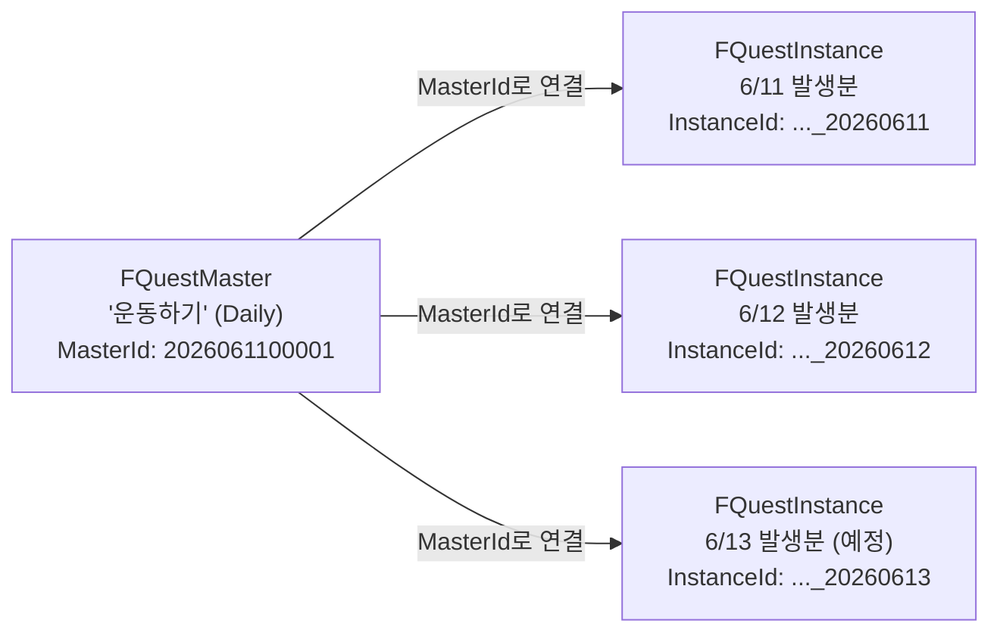

# 데이터 구조 가이드 (역할 & 필드 정리)

> 이 문서는 RecordTales의 모든 구조체(Struct)·열거형(Enum)을 한곳에 모아, **"이 구조체는 왜 있는가(역할)"**와 **"각 필드에는 어떤 값이 들어가는가(필드/타입/예시값)"**를 정리한 참고 문서입니다.
> 전체 파일 의존 구조는 [cpp-file-structure.md의 0번 섹션](./cpp-file-structure.md#0-구조-한눈에-보기)을 함께 참고하세요.

---

## 목차

0. [전체 구조 한눈에 보기](#0-전체-구조-한눈에-보기)
1. [Focus 시스템 구조체](#1-focus-시스템-구조체)
2. [Archive 시스템 구조체](#2-archive-시스템-구조체)
3. [Quest 시스템 구조체](#3-quest-시스템-구조체)
4. [SaveGame 저장 필드 전체 정리](#4-savegame-저장-필드-전체-정리)
5. [Enum 전체 정리](#5-enum-전체-정리)

---

## 0. 전체 구조 한눈에 보기

**읽는 법**
- `RecordTalesSaveGame`은 Focus / Archive / Quest 세 영역의 데이터를 각각 담는 "큰 상자"입니다.
- Quest 영역만 특별히 **원본(Master) ↔ 진행상황(Instance)** 두 종류로 나뉘어 있습니다. 자세한 이유는 [3. Quest 시스템 구조체](#3-quest-시스템-구조체)를 참고하세요.

---

## 1. Focus 시스템 구조체

### FTimerConfig — 타이머 설정값 (영속 ✅)

**역할**: 사용자가 설정한 타이머 옵션을 담는다. 세이브 파일에 저장되어 앱을 재시작해도 유지된다.

| 필드 | 타입 | 설명 | 예시 값 |
|---|---|---|---|
| `FocusDuration` | int32 | 집중 시간(분). 기본 25, 범위 1~180 | `25` |
| `RestDuration` | int32 | 일반 휴식 시간(분). 기본 5 | `5` |
| `LastRestDuration` | int32 | 마지막 사이클의 휴식 시간(분). 기본 15 | `15` |
| `SingleRestDuration` | int32 | `RepeatCount == 1`일 때만 쓰이는 휴식(분). 기본 5 | `5` |
| `RepeatCount` | int32 | 집중→휴식을 몇 번 반복할지. 기본 4, 범위 1~10 | `4` |
| `bIsRoutine` | bool | 루틴 모드 여부. `false`면 1회 집중만 진행 | `false` |
| `bAutoRestart` | bool | 루틴 완료 후 자동으로 처음부터 재시작할지 | `false` |

---

### FTimerRuntimeState — 타이머 진행 상태 (비영속 ❌)

**역할**: 타이머가 "지금 돌아가고 있을 때만" 의미 있는 상태. 저장 대상이 아니므로 앱을 끄면 사라진다.

| 필드 | 타입 | 설명 | 예시 값 |
|---|---|---|---|
| `CurrentPhase` | `ETimerPhase` | 현재 진행 단계 | `Focusing` |
| `PrevPhase` | `ETimerPhase` | 일시정지 직전 단계 (재개 시 복원용) | `Focusing` |
| `RemainingSeconds` | int32 | 현재 단계에서 남은 시간(초) | `842` |
| `TotalSeconds` | int32 | 현재 단계의 전체 시간(초) — 진행률(%) 계산용 | `1500` |
| `CycleIndex` | int32 | 현재 몇 번째 사이클인지 (1부터 시작) | `2` |
| `AccFocusSeconds` | int32 | `Focusing` 단계에서만 누적된 순수 집중 시간(초) | `1980` |
| `SessionConfig` | `FTimerConfig` | 세션 시작 시점에 복사해 둔 설정값 (진행 중 설정 변경의 영향을 받지 않음) | `FTimerConfig` 복사본 |

---

### FStopwatchState — 스톱워치 진행 상태 (비영속 ❌)

**역할**: 스톱워치가 동작 중일 때의 상태. 저장하지 않는다.

| 필드 | 타입 | 설명 | 예시 값 |
|---|---|---|---|
| `bRunning` | bool | 현재 가동 중인지 | `true` |
| `bPaused` | bool | 일시정지 상태인지 | `false` |
| `ElapsedSeconds` | int32 | 시작부터 누적된 경과 시간(초). 시작 시 0 | `305` |

---

## 2. Archive 시스템 구조체

### FCategoryDef — 카테고리 정의 (영속 ✅)

**역할**: 사용자가 추가/수정/삭제할 수 있는 카테고리(이름+색상) 정보. `FSessionRecord.Category`, `FQuestMaster.Category`가 이 `Name`을 참조한다.

| 필드 | 타입 | 설명 | 예시 값 |
|---|---|---|---|
| `Name` | FString | 카테고리 이름. 다른 구조체의 `Category` 필드와 매칭되는 고유 키 | `"공부"` |
| `Color` | FString | `"#RRGGBB"` 형식 HEX 색상. 빈 문자열이면 기본(폴백) 색상 사용 | `"#7F77DD"` 또는 `""` |

> 기본 카테고리: 공부 / 프로젝트 / 업무 / 독서 / 운동 / 기타 (모두 `Color=""`)

---

### FSessionRecord — 집중 세션 기록 1건 (영속 ✅)

**역할**: 타이머/스톱워치 세션이 끝날 때마다 1건씩 생성되어 아카이브에 누적되는 "기록"이다.

| 필드 | 타입 | 설명 | 예시 값 |
|---|---|---|---|
| `RecordId` | FString | 고유 ID. `"YYYYMMDD"` + 5자리 일련번호 | `"2026061200001"` |
| `SessionType` | `EFocusMode` | 타이머 세션인지 스톱워치 세션인지 | `Timer` |
| `Category` | FString | 카테고리 이름 (`FCategoryDef.Name` 참조) | `"공부"` |
| `DurationSeconds` | int32 | 세션의 총 경과 시간(초) | `6000` |
| `FocusSeconds` | int32 | 그중 순수 집중 시간(초). XP 계산 등에 사용 | `5400` |
| `bNormalEnd` | bool | 정상 완료 여부 (`false` = 중도 정지) | `true` |
| `Notes` | FString | 사용자가 남긴 메모. 빈 문자열 가능 | `"오전 집중 세션"` |
| `RecordedAt` | FDateTime | 기록이 생성된 시각(세션 종료 시점) | `2026-06-12 09:42:11` |
| `DateKey` | FString | 날짜 키 `"YYYYMMDD"`. 캘린더/필터링에 사용 | `"20260612"` |

---

### FArchiveDateRange — 조회 날짜 범위 (비영속 ❌)

**역할**: 아카이브를 조회할 때 "일간/주간/월간" 필터에 맞춰 즉석으로 계산되는 시작~종료 날짜.

| 필드 | 타입 | 설명 | 예시 값 |
|---|---|---|---|
| `Start` | FString | 범위 시작일 `"YYYYMMDD"` | `"20260608"` |
| `End` | FString | 범위 종료일 `"YYYYMMDD"` | `"20260614"` |

---

### FDayActivityDots — 날짜별 활동 도트 (비영속 ❌)

**역할**: 캘린더의 한 날짜 칸에 표시할 점(dot) 정보. `TMap<FString /*YYYYMMDD*/, FDayActivityDots>` 형태로 한 달치를 한 번에 들고 있는다.

| 필드 | 타입 | 설명 | 예시 값 |
|---|---|---|---|
| `bHasTimer` | bool | 해당 날짜에 타이머 기록이 있음 → **오렌지** 점 표시 | `true` |
| `bHasStopwatch` | bool | 해당 날짜에 스톱워치 기록이 있음 → **그린** 점 표시 | `false` |
| `bHasQuest` | bool | 해당 날짜가 퀘스트의 마감일(`DueDateKey`) 또는 완료일(`CompletedDateKey`)과 일치 → **옐로** 점 표시 | `true` |

---

### FArchiveFilterState — 현재 필터 상태 (비영속 ❌)

**역할**: 아카이브 패널을 켜둔 동안 사용자가 선택한 필터/위치를 기억하는 UI 상태값.

| 필드 | 타입 | 설명 | 예시 값 |
|---|---|---|---|
| `PeriodFilter` | `EArchPeriodFilter` | 일간/주간/월간 중 어떤 단위로 볼지 | `Weekly` |
| `ModeFilter` | `EArchModeFilter` | 전체/타이머만/스톱워치만 | `All` |
| `CategoryFilter` | FString | 카테고리 필터. 빈 문자열 = 전체 카테고리 | `""` |
| `AnchorDateKey` | FString | 사용자가 캘린더에서 클릭한 기준 날짜 | `"20260612"` |
| `CalYear` | int32 | 캘린더에 표시 중인 연도 | `2026` |
| `CalMonth` | int32 | 캘린더에 표시 중인 월 (1~12) | `6` |

---

### FArchiveQueryResult — 조회 결과 (비영속 ❌)

**역할**: `QueryArchive()` 호출 결과를 담아 위젯에 그대로 전달하는 "결과 묶음".

| 필드 | 타입 | 설명 | 예시 값 |
|---|---|---|---|
| `DateRange` | `FArchiveDateRange` | 이번 조회에 적용된 날짜 범위 | `{Start:"20260608", End:"20260614"}` |
| `FilteredSessions` | `TArray<FSessionRecord>` | 필터를 통과한 집중 기록 목록 (`RecordedAt` 오름차순) | `[세션1, 세션2, ...]` |
| `DoneQuests` | `TArray<FQuestInstance>` | 범위 내 완료된 퀘스트 인스턴스 | `[...]` |
| `ActiveQuests` | `TArray<FQuestInstance>` | 범위 내 진행 중인 퀘스트 인스턴스 | `[...]` |
| `OverdueQuests` | `TArray<FQuestInstance>` | 범위 내 기한 초과 퀘스트 인스턴스 | `[...]` |
| `SuspendedQuests` | `TArray<FQuestInstance>` | 범위 내 중단된 퀘스트 인스턴스 | `[...]` |
| `UpcomingQuests` | `TArray<FQuestInstance>` | 범위 내 예정된 퀘스트 인스턴스 (마스터별 1건) | `[...]` |
| `ActivityDotMap` | `TMap<FString, FDayActivityDots>` | 해당 월 전체 날짜의 도트 데이터 | `{"20260601": {...}, ...}` |

---

## 3. Quest 시스템 구조체

> Quest는 "**마스터(Master)** = 변하지 않는 원본/설정"과 "**인스턴스(Instance)** = 매 회차의 진행 상태"로 나뉩니다.
> 예를 들어 "매일 운동하기"라는 반복 퀘스트는 마스터 1개 + 매일 생성되는 인스턴스 여러 개로 구성됩니다.

---

### FQuestMaster — 퀘스트 원본/템플릿 (영속 ✅, 거의 불변)

**역할**: "이 퀘스트가 무엇이고, 언제·어떻게 반복되는가"만 정의한다. 진행 상태(완료 여부 등)는 가지지 않으며, **절대 삭제되지 않는다**.

| 필드 | 타입 | 설명 | 예시 값 |
|---|---|---|---|
| `MasterId` | FString | 고유 ID. `"YYYYMMDD"` + 5자리 일련번호. **생성 후 불변** | `"2026061100001"` |
| `Title` | FString | 퀘스트 제목 (최대 80자) | `"운동하기"` |
| `Description` | FString | 설명 (선택사항) | `"30분 이상 걷기"` |
| `Category` | FString | 카테고리 이름 (`FCategoryDef.Name` 참조) | `"운동"` |
| `Recurrence` | `EQuestRecurrence` | 반복 주기 | `Daily` |
| `StartDateKey` | FString | 시작일 `"YYYYMMDD"`. **생성 후 불변** | `"20260611"` |
| `DeadlineDateKey` | FString | 마감일 (단발 퀘스트 전용). 빈 문자열이면 시작일이 곧 마감일 | `""` |
| `DeadlineOffsetDays` | int32 | 발생일로부터 며칠 뒤 마감인지 (반복 퀘스트 전용, **불변**). `-1` = 오프셋 없음(발생일=마감일) | `0` |
| `RecEndDateKey` | FString | 반복 종료일. 빈 문자열이면 `StartDateKey + 1년` | `""` |
| `bIsFavorite` | bool | 즐겨찾기 여부. 체크 시 "오늘 퀘스트로 복제" 버튼 노출 | `false` |

---

### FQuestInstance — 퀘스트 인스턴스 (영속 ✅, 회차별 진행 상태)

**역할**: 화면에 실제로 표시되는 단위. `MasterId`로 `FQuestMaster`를 찾아 제목/카테고리 등을 가져오고, 자기 자신은 "이번 회차의 진행 상태"만 들고 있는다.

| 필드 | 타입 | 설명 | 예시 값 |
|---|---|---|---|
| `InstanceId` | FString | `"MasterId" + "_" + "OccurrenceDateKey"` (결정적 생성, 중복 방지에 사용) | `"2026061100001_20260612"` |
| `MasterId` | FString | 부모 마스터의 ID | `"2026061100001"` |
| `OccurrenceDateKey` | FString | 이 인스턴스가 "발생한" 날짜 `"YYYYMMDD"` | `"20260612"` |
| `DueDateKey` | FString | 마감일 `"YYYYMMDD"` (D-day 계산 기준) | `"20260612"` |
| `bDone` | bool | 완료 여부 | `false` |
| `CompletedAt` | FDateTime | 완료 처리된 시각 (`bDone==true`일 때만 의미 있음) | 미설정 |
| `CompletedDateKey` | FString | 완료된 날짜 키. 아카이브 분류(`FDayActivityDots`)에 사용 | `""` |
| `bSuspended` | bool | 중단 여부 | `false` |
| `SuspendedAt` | FDateTime | 중단 처리된 시각 | 미설정 |
| `SuspendReason` | FString | 중단 이유 | `""` |
| `GoldReward` | int32 | 완료 시 지급되는 골드 보상 | `10` |
| `XpReward` | int32 | 완료 시 지급되는 XP 보상 | `5` |
| `State` | `EQuestState` | 현재 상태의 **캐시**. `ToggleDone`/`ToggleSuspend`/`ProcessDailyRollover` 시점에 재계산 | `Active` |

---

### FDdayInfo — D-day 표시 정보 (비영속 ❌)

**역할**: `DueDateKey`를 오늘 날짜와 비교해 "D-3", "D-DAY", "D+1" 같은 라벨과 강조 색을 계산한 결과. 화면 표시용으로만 쓰이고 저장하지 않는다.

| 필드 | 타입 | 설명 | 예시 값 |
|---|---|---|---|
| `Label` | FString | 표시 문자열. `Diff > 0`이면 `"D-{Diff}"`, `Diff == 0`이면 `"D-DAY"`, `Diff < 0`이면 `"D+{-Diff}"` | `"D-3"` |
| `bNear` | bool | `Diff`가 1~3일 때 `true` (노랑/주황 강조) | `true` |
| `bToday` | bool | `Diff == 0`일 때 `true` (D-DAY, 주황) | `false` |
| `bOverdue` | bool | `Diff < 0`일 때 `true` (기한 초과, 빨강) | `false` |

여기서 `Diff = DaysBetween(오늘, DueDateKey)` (마감일 - 오늘).

**색상 규칙**

| 조건 | 색상 |
|---|---|
| D-7 이상 | 초록 |
| D-1 ~ D-6 (`bNear`) | 노랑/주황 |
| D-DAY (`bToday`) | 주황 |
| D+1 이상 (`bOverdue`) | 빨강 |

---

## 4. SaveGame 저장 필드 전체 정리

`RecordTalesSaveGame.h`에 실제로 저장되는(=앱을 꺼도 유지되는) 모든 필드를 한 곳에 모았습니다.

| 그룹 | 필드명 | 타입 | 설명 |
|---|---|---|---|
| Focus | `LastTimerConfig` | `FTimerConfig` | 마지막으로 사용한 타이머 설정 |
| Focus | `LastFocusMode` | `EFocusMode` | 마지막으로 사용한 모드(타이머/스톱워치) |
| Archive | `SessionRecords` | `TArray<FSessionRecord>` | 전체 집중 세션 기록 목록 |
| Archive | `Categories` | `TArray<FCategoryDef>` | 사용자 정의 카테고리 목록 |
| Archive | `LastRecordDate` | FString | `RecordId` 생성용, 마지막으로 기록을 만든 날짜 |
| Archive | `DailyRecordSequence` | int32 | 같은 날짜 안에서의 기록 일련번호 |
| Quest | `QuestMasters` | `TArray<FQuestMaster>` | 모든 퀘스트의 "원본" 목록 |
| Quest | `QuestInstances` | `TArray<FQuestInstance>` | 회차별 진행 상태 목록 |
| Quest | `LastQuestDate` | FString | `MasterId` 생성용, 마지막으로 마스터를 만든 날짜 |
| Quest | `DailyQuestSequence` | int32 | 같은 날짜 안에서의 퀘스트 일련번호 |
| Quest | `LastQuestRolloverDate` | FString | 자정 롤오버를 마지막으로 처리한 날짜 (며칠 안 켜도 따라잡기용) |

---

## 5. Enum 전체 정리

| Enum | 값 | 의미 |
|---|---|---|
| `EFocusMode` | `Timer` / `Stopwatch` | 집중 패널의 현재 모드 |
| `ETimerPhase` | `Idle` / `Focusing` / `Resting` / `LastResting` / `Paused` | 타이머의 현재 진행 단계 |
| `ESessionEndReason` | `NormalComplete` / `EarlyStop` | 세션이 끝난 이유 (정상 완료 / 중도 정지) |
| `EArchPeriodFilter` | `Daily` / `Weekly` / `Monthly` | 아카이브 조회 기간 단위 |
| `EArchModeFilter` | `All` / `TimerOnly` / `SwOnly` | 아카이브 조회 시 세션 종류 필터 |
| `EDeleteCategoryMode` | `MigrateToOther` / `KeepOrphan` / `DeleteRecords` | 카테고리 삭제 시 관련 기록 처리 방식 |
| `EQuestRecurrence` | `None` / `Daily` / `Weekly` / `Monthly` | 퀘스트 반복 주기 |
| `EQuestState` | `Active` / `Done` / `Overdue` / `Suspended` / `Upcoming` | 퀘스트 인스턴스의 현재 상태. 우선순위: `Suspended > Done > Upcoming > Overdue > Active` |

---

## 업데이트 이력

| 날짜 | 내용 |
|---|---|
| 2026-06-12 | 초안 작성. `focus-archive-data.md`, `quest-data.md`, `cpp-file-structure.md`를 바탕으로 모든 구조체/Enum의 역할 설명과 필드별 타입/설명/예시값을 정리 |
